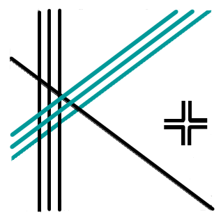
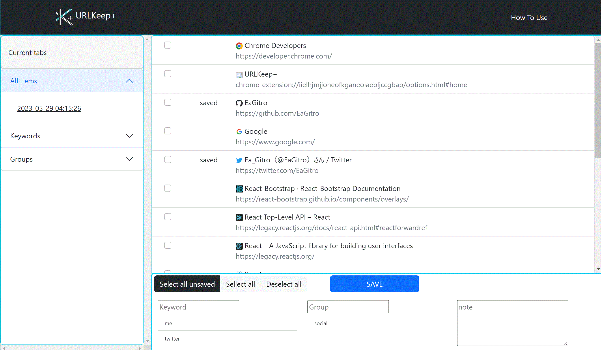

<!-- title: How To Use URLKeep+ -->

# URLKeep+

This is a chrome extension.  This app manage tabs and URLs, and save URLs with keywords, group names and note.

# How to get this app

Stable version is available at [Chrome Web Store]().

Latest version is available at [`./dist`](/dist/) dir. 

# Features

* Store tabs and URLs with category information such as keywords, group names and notes.
* Display stored items categoried according to the dates when you saved, the keywords, or the group names.
* Manage your stored data.
* Open current tabs or saved items. 

# Usage

1. Side Menu:    
    * Choose modes such as current tubs, keywords, or groups.
2. Main Panel:   
    * Display current tabs or saved items.
3. Sub Panel:    
    * Save current tabs with certain keyword, group name, and note, or rewrite information of saved items, or delete items

## 1. Side Menu

You can choose the mode. 

If you select ***"Current tabs"*** , you can see what you **open in your browser now** in Main Panel (default).   
If you select ***"All items"*** , you can see **when you saved items**. Then, to click a certain date, you can see what you have saved **at this time**.    
If you select ***"keywords"*** or ***"Groups"*** , you can see the keywords or the group names you saved. To click the keyword or group name, **items saved with the keyword/group** are displayed.   

## 2. Main Panel

Display current tabs or saved items.

If you select ***"Current tabs"*** , you can see what you **open in your browser now**. And "saved" flag is attached on the items you have saved. When you click the item, you will jump to the tab.

If you select the other mode in Side Menu, you can see the items that you **saved with a certain category**. When you hover over the items, the bubble that contains the date when you saved, the keyword, the group name, and the note is displayed.

## 3. Sub Panel

Save current tabs with certain categories, rewrite information, or delete items.

If you select ***"Current tabs"*** , you can save **current tabs with certain categories** such as a keyword, group name, and note.    
When you enter category information, you can register a new keyword or a new group name, or choose them from what you have entered before.

If you select the other mode in Side Menu, you can **open the selected items**, or you can **rewrite the information** of the selected items, or **delete the selected items**.

# Author

EaGitro 

Contact(in English or Japanese):
* Twitter: [@EaGitro](https://twitter.com/EaGitro)
* GitHub: [EaGitro](https://github.com/EaGitro)
* RESUME: [EaGitro](https://www.resume.id/ea_gitro)

© EaGitro 2023 All Rights Reserved.