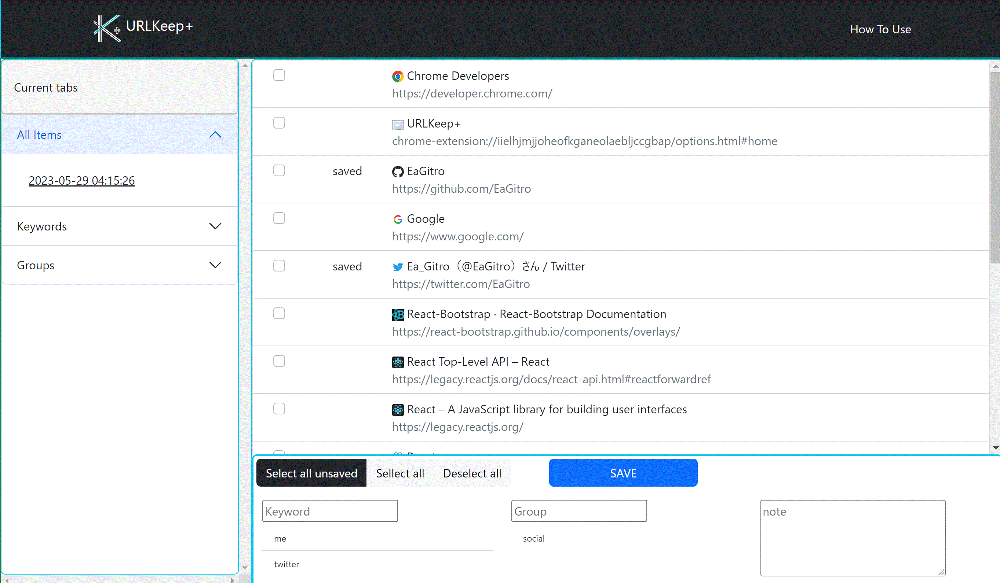

# URLKeep+

Chrome の拡張機能です。      
Chrome から提供されている API を用いてタブ情報の取得を行い、目印となるキーワードやグループ、メモなどをつけて保存することができます。

# 入手場所

GitHub: [https://github.com/EaGitro/URLKeepPlus](https://github.com/EaGitro/URLKeepPlus)

Google Web Store (審査中): [https://chrome.google.com/webstore/detail/URLKeep+/mhjmgbgkkpikgohjidjgipahbnehkdkd](https://chrome.google.com/webstore/detail/URLKeep+/mhjmgbgkkpikgohjidjgipahbnehkdkd)

# 使用技術

* TypeScript 
* React (v.18)
* Bootstrap (v5.0)
* React-Bootstrap
* Babel
* Webpack

# 機能一覧

* タブ情報の取得・表示
* キーワード、グループ名、メモをつけての URL の保存
* 保存した URL の分類別表示

# Author

EaGitro

* twitter: [@EaGitro](https://twitter.com/EaGitro)
* GitHub: [EaGitro](https://github.com/EaGitro)
* RESUME: [EaGitro](https://www.resume.id/ea_gitro)
    * [My profile](https://www.resume.id/works/1ee6c9c7c271dcc1)